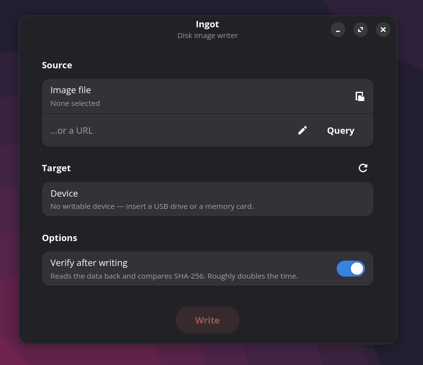

# Ingot

A disk image writer for Linux. Ingot writes Linux ISO images and Raspberry Pi OS
images to USB drives and memory cards — including NVMe and SATA drives in USB
enclosures — and, for Raspberry Pi OS, seeds first-boot settings into
`bootfs/custom.toml`.

The interface is in English and ships a Turkish translation, picked from the
session language.



## Why

`rpi-imager` 2.x cannot be used on Wayland: it relaunches its entire interface
as root, and Wayland does not let a root GUI connect to the compositor of a
normal session. It asks for a password and then silently dies
([#1336](https://github.com/raspberrypi/rpi-imager/issues/1336),
[#1376](https://github.com/raspberrypi/rpi-imager/issues/1376), still open).
`rpi-imager` is not in the Debian archive, its Flatpak was removed from Flathub,
and `etcher-cli` is deprecated.

Ingot avoids the problem by construction: **the interface never runs as root.**
Only a small helper with no display of its own is elevated through `pkexec`. The
password prompt comes from the user's own polkit agent, so that class of failure
cannot occur.

## Installing

Download the `.deb` from the
[latest release](https://github.com/orkun-soylu/ingot/releases/latest) and
install it with apt:

```bash
sudo apt install ./ingot_*_all.deb
```

apt pulls in the dependencies. The package is `Architecture: all`, so the same
file installs on every Debian or Ubuntu architecture.

Removing:

```bash
sudo apt purge ingot      # leaves no files, polkit rule or menu entry behind
```

Ingot replaces **kalip**, the project's earlier name: installing it removes the
old package, and images downloaded under the old name are carried over.

What the package installs:

| What | Where |
|---|---|
| Application | `/usr/bin/ingot`, `/usr/lib/python3/dist-packages/ingot/` |
| Privileged helper | `/usr/libexec/ingot/ingot-helper` (dpkg installs it `root:root 0755`) |
| polkit rule | `/usr/share/polkit-1/actions/me.soylu.ingot.policy` |
| Translations | `/usr/share/locale/tr/LC_MESSAGES/ingot.mo` |
| Menu entry and icon | `/usr/share/applications/`, `/usr/share/icons/hicolor/` |
| Manual | `man ingot` |

> The helper's path is fixed in the polkit rule and **only root can write the
> file**. There are no maintainer scripts; dpkg already installs the files owned
> by root.

## Using

```
ingot                       # or "Ingot" from the menu
ingot ~/Downloads/x.iso     # open with a file
```

**Local file:** click the image file row and pick one.

**URL:** paste the address and press `Query`. It works like Proxmox's "Download
from URL": redirects are followed, and the file name (from `Content-Disposition`,
otherwise the final URL), size and content type are shown along with whether the
download can be resumed. `Download` saves the file under `~/.cache/ingot/`, so
writing the same image again does not fetch it twice.

Supported formats: `.iso` `.img` `.raw` `.img.xz` `.img.gz` `.img.zst` `.zip`
(detected from magic bytes, not the extension).

**The Raspberry Pi OS panel** only appears when the image really is a Raspberry Pi
OS image. Detection reads the MBR (a FAT partition followed by a Linux one)
through the compression and ignores the file name; ISO images are isohybrid and
do not produce false positives. Keyboard layout, time zone and Wi-Fi country
default to the settings of the machine doing the writing.

## Safety

Writing to the wrong device is the one real risk. The gates:

- **System disks are never listed.** A disk holding `/`, `/boot`,
  `/boot/firmware`, `/home`, `/usr`, `/var`, `/nix` or swap is not built into
  the list at all.
- **Only removable devices are listed.** NVMe or SSD drives in USB enclosures
  count (`tran=usb`); internal disks never appear in the interface.
- **The helper does not trust the interface.** It repeats the checks as root
  with `lsblk`. That is the real gate; the interface's filters only shape the
  experience.
- The device is opened with **`O_EXCL`**, so the kernel refuses a device in use.
- An image larger than the device is caught **before** writing starts.
- The password reaches `openssl passwd -6` **on stdin**; in argv `ps` would show
  it. (Python 3.13 removed the `crypt` module, hence openssl.)

With **verification** on, the written range is read back and compared by
SHA-256. `posix_fadvise(DONTNEED)` is called first; otherwise the page cache
would be verified instead of the device.

**Cancelling** goes through stdin (`CANCEL`), not a signal: the helper is root
and the interface is not, so it cannot signal it. If the interface crashes the
pipe closes and the helper stops writing.

## Translations

English is the source language. The root helper never produces interface text:
pkexec does not pass the session language on, so the helper emits stable codes
(`E system_disk {"device": …}`) and `ingot/messages.py` translates them in the
user's process.

Catalogues live in `po/`. A translatable string without a translation is a
build failure — `debian/rules` extracts every message with `xgettext` and checks
each catalogue with `msgcmp`; the unit tests check the same and also that
`{placeholders}` survive translation.

Adding a language: add its code to `po/LINGUAS` and create `po/<code>.po`.

## Limits

- `custom.toml` applies to **Raspberry Pi OS bookworm and later**. Older releases
  need `ssh` plus `userconf.txt`, which Ingot does not write.
- `custom.toml` **cannot express static addressing or multiple Wi-Fi networks** —
  a limit of the format. Use a DHCP reservation for a fixed address.
- For `.gz` images the decompressed size wraps above 4 GiB (a limit of gzip); the
  progress bar becomes indeterminate, the write is unaffected.
- The `.bz2` extension is recognised but cannot be written.

## Development

```bash
python3 -m unittest discover -s tests -v    # core tests, no GUI needed
xvfb-run -a python3 tests/smoke_gui.py      # headless interface smoke test
PYTHONPATH=. python3 -m ingot               # run without installing
```

Running the interface in Turkish from a checkout:

```bash
mkdir -p build-i18n/locale/tr/LC_MESSAGES
msgfmt -o build-i18n/locale/tr/LC_MESSAGES/ingot.mo po/tr.po
LANGUAGE=tr PYTHONPATH=. python3 -m ingot
```

Building the package:

```bash
sudo apt build-dep .
dpkg-buildpackage -us -uc -b
lintian ../ingot_*.deb
```

The tests also run during the package build (`override_dh_auto_test`), so a
change that breaks them cannot produce a package.

The helper can be driven without the interface — the quickest way to debug:

```bash
sudo ./helper/ingot-helper --device /dev/sdb --source pios.img.xz \
     --compression xz --payload-size 5368709120 --verify --toml custom.toml
```

Testing against a loop device without touching real hardware:

```bash
truncate -s 200M /tmp/target.raw
T=$(sudo losetup --show -fP /tmp/target.raw)
sudo ./helper/ingot-helper --device "$T" --source ... && sudo losetup -d "$T"
```

### Layout

```
ingot/devices.py      lsblk -> device list, system disk exclusion
ingot/source.py       format detection, decompressed size, streaming, Pi MBR signature
ingot/remote.py       URL query and download through curl
ingot/picfg.py        custom.toml generation, validation, host locale defaults
ingot/messages.py     translations for the helper's status and error codes
ingot/privileged.py   pkexec bridge, line-based event protocol
ingot/i18n.py         gettext setup
ingot/ui/window.py    GTK 4 + libadwaita interface
helper/ingot-helper   root side: validate, write, verify, seed
po/                   translation catalogues
```
